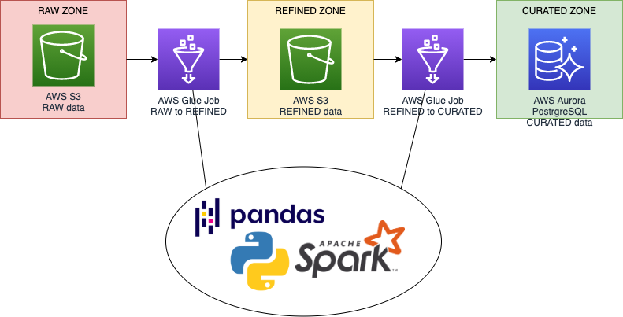

# aws-glue-monorepo-style

An example of AWS Glue Jobs and workflow deployment with terraform in monorepo style.

To learn more about decisions behind this structure chek out the supporting articles:
https://dev.to/1oglop1/aws-glue-first-experience-part-1-how-to-run-your-code-3pe3

## Deployment:

Before deploying I highly recommend using find and replace this string `your-awsglue-bucket` to a bucket name you like.

Requirements:

* AWS Account
* S3 bucket to store terraform state.

* set environment variables according to `.evn.example`
* `docker-compose up -d`
* `docker exec -it pytf /bin/bash`

Now we are going to work inside the docker container

* `make tf-init`
* `make tf-plan`
* `make tf-apply`
* `make jobs-deploy`

That's it!
If everything went well you can now go to AWS Glue Console and explore jobs and workflows. 

Or start workflow from CLI `aws glue start-workflow-run --name etl-workflow`

Once you are finished with observations remove everything with  `make tf-destroy`.

## Disclaimer

Please keep in mind that IAM roles used in this example are very broad and should not be used as is.